# Skills & Preferences

[](https://skillicons.dev)


# 用Markdown绘制图表

[TOC]


### 序列图sequence

此功能使用[js-sequence](https://bramp.github.io/js-sequence-diagrams/)，它将以下代码块转换为渲染图：

```sequence
Alice->Bob: Hello Bob, how are you?
Note right of Bob: Bob thinks
Bob-->Alice: I am good thanks!
```

[自定义CSS中](https://support.typora.io/Add-Custom-CSS/)添加以下CSS来设置序列图的主题，支持的值是`simple`（默认）和`hand`(手写风格)。

```css
:root {
	--sequence-theme: hand
}
```

```sequence
Andrew->China: Says Hello
Note right of China: China thinks\nabout it
China-->Andrew: How are you?
Andrew->>China: I am good thanks!
```


```sequence
participant C
participant B
participant A
Note right of A: By listing the participants\n you can change their order
```

```sequence
# Example of a comment.
Note left of A: Note to the\n left of A
Note right of A: Note to the\n right of A
Note over A: Note over A
Note over A,B: Note over both A and B
```

```sequence
Title: Here is a title
A->B: Normal line
B-->C: Dashed line
C->>D: Open arrow
D-->>A: Dashed open arrow
```

```sequence
Title: Here is a title
A->B:
B->C:
C->C:
# A->B: Normal line
A->B: Normal line\nwith\nmany\nlines
B-->C: Dashed line
C->>D: Open arrow
D-->>A: Dashed open arrow
# D->D: Self
D->D: Self\nMany\nLines
```


### 流程图

此功能使用[flowchart.js](http://flowchart.js.org/)，它将以下代码块转换为渲染图：

```flow
st=>start: Start
op=>operation: Your Operation
cond=>condition: Yes or No?
e=>end

st->op->cond
cond(yes)->e
cond(no)->op
```

```flow
st=>start: Need something to be translated!:>https://www.localistars.com[blank]
e=>end: Be happy!:>https://youtu.be/e6Ede8hdU8c
cond=>condition: Are you a client
or a translator?
subc=>subroutine: Why should you choose a localistar?:>https://www.localistars.com/for-clients.html
subt=>subroutine: Why should you become a localistar?:>https://www.localistars.com/for-translators.html
op=>operation: Check out how it works!:>https://www.localistars.com/how-it-works.html
io=>inputoutput: Work together with your partner!:>https://www.localistars.app/login

st->cond
cond(no@client)->subc->op->io->e
cond(yes@translator)->subt->op->io->e
```

```flow
st=>start: Improve your
l10n process!
e=>end: Continue to have fun!:>https://youtu.be/YQryHo1iHb8[blank]
op1=>operation: Go to locize.com:>https://locize.com[blank]
sub1=>subroutine: Read the awesomeness
cond(align-next=no)=>condition: Interested to
getting started?
io=>inputoutput: Register:>https://www.locize.app/register[blank]
sub2=>subroutine: Read about improving
your localization workflow
or another source:>https://medium.com/@adrai/8-signs-you-should-improve-your-localization-process-3dc075d53998[blank]
op2=>operation: Login:>https://www.locize.app/login[blank]
cond2=>condition: valid password?
cond3=>condition: reset password?
op3=>operation: send email
sub3=>subroutine: Create a demo project
sub4=>subroutine: Start your real project
io2=>inputoutput: Subscribe

st->op1->sub1->cond
cond(yes)->io->op2->cond2
cond2(no)->cond3
cond3(no,bottom)->op2
cond3(yes)->op3
op3(right)->op2
cond2(yes)->sub3
sub3->sub4->io2->e
cond(no)->sub2(right)->op1

st@>op1({"stroke":"Red"})@>sub1({"stroke":"Red"})@>cond({"stroke":"Red"})@>io({"stroke":"Red"})@>op2({"stroke":"Red"})@>cond2({"stroke":"Red"})@>sub3({"stroke":"Red"})@>sub4({"stroke":"Red"})@>io2({"stroke":"Red"})@>e({"stroke":"Red","stroke-width":6,"arrow-end":"classic-wide-long"})
```

```flow
st=>start: Start|past:>http://www.google.com[blank]
e=>end: End|future:>http://www.google.com
op1=>operation: My Operation|past
op2=>operation: Stuff|current
sub1=>subroutine: My Subroutine|invalid
cond=>condition: Yes
or No?|approved:>http://www.google.com
c2=>condition: Good idea|rejected
io=>inputoutput: catch something...|future

st->op1(right)->cond
cond(yes, right)->c2
cond(no)->sub1(left)->op1
c2(yes)->io->e
c2(no)->op2->e
```

## mermaid图标绘制

支持序列图、流程图、甘特图、类和状态图以及饼图。

### 序列图

https://mermaid.js.org/syntax/sequenceDiagram.html

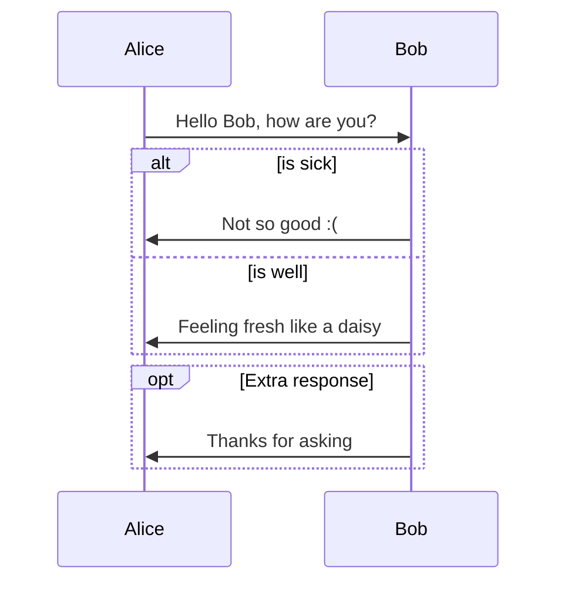
```mermaid
%% Example of sequence diagram
  sequenceDiagram
    Alice->>Bob: Hello Bob, how are you?
    alt is sick
    Bob->>Alice: Not so good :(
    else is well
    Bob->>Alice: Feeling fresh like a daisy
    end
    opt Extra response
    Bob->>Alice: Thanks for asking
    end
```

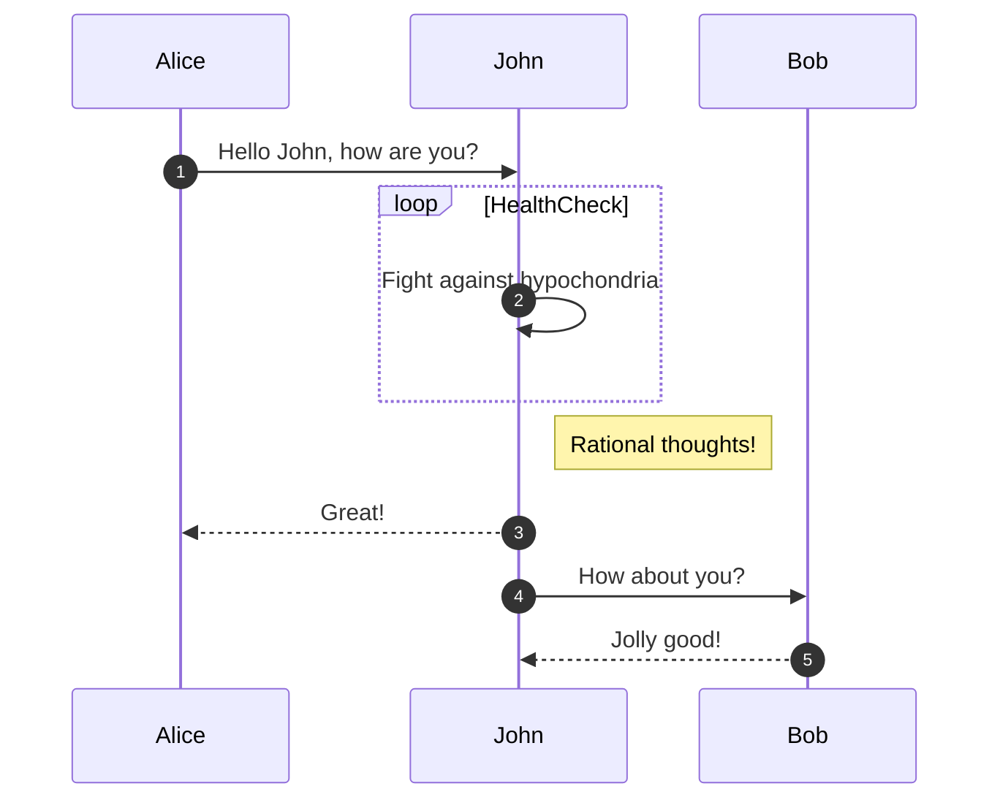
```mermaid
sequenceDiagram
    autonumber
    Alice->>John: Hello John, how are you?
    loop HealthCheck
        John->>John: Fight against hypochondria
    end
    Note right of John: Rational thoughts!
    John-->>Alice: Great!
    John->>Bob: How about you?
    Bob-->>John: Jolly good!

```

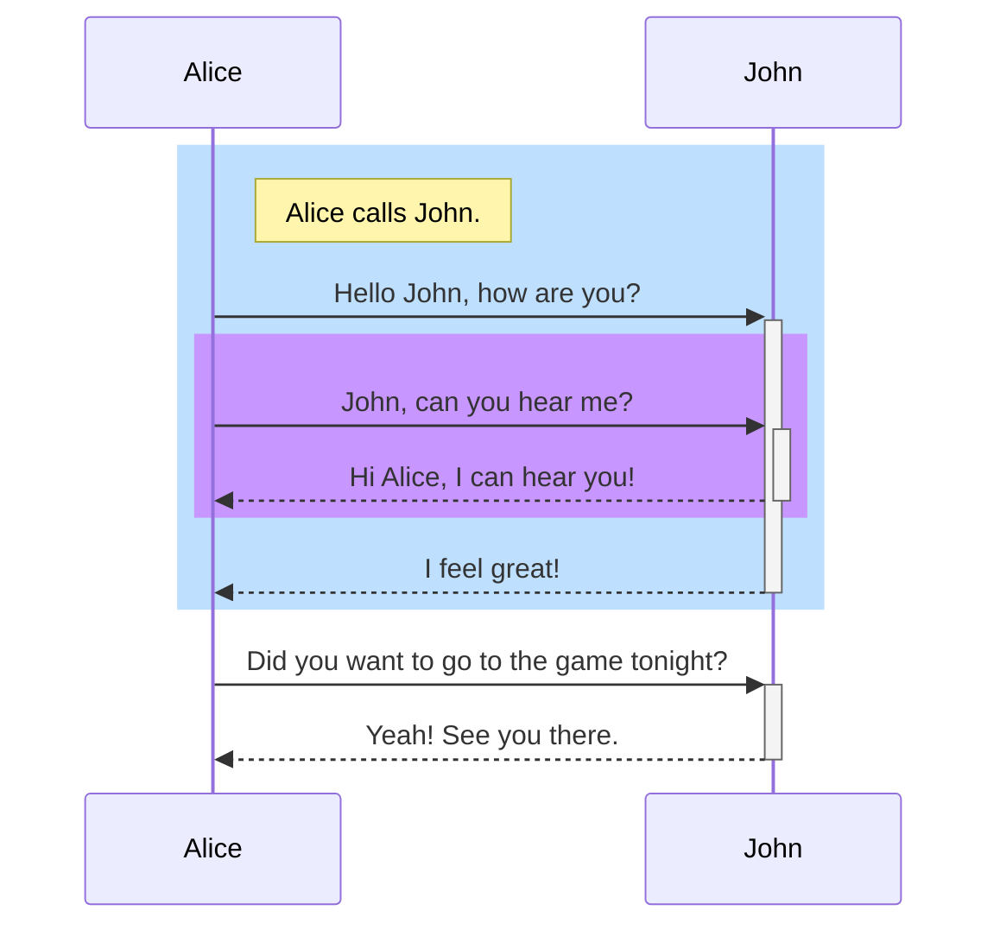
```mermaid
sequenceDiagram
    participant Alice
    participant John

    rect rgb(191, 223, 255)
    note right of Alice: Alice calls John.
    Alice->>+John: Hello John, how are you?
    rect rgb(200, 150, 255)
    Alice->>+John: John, can you hear me?
    John-->>-Alice: Hi Alice, I can hear you!
    end
    John-->>-Alice: I feel great!
    end
    Alice ->>+ John: Did you want to go to the game tonight?
    John -->>- Alice: Yeah! See you there.


```

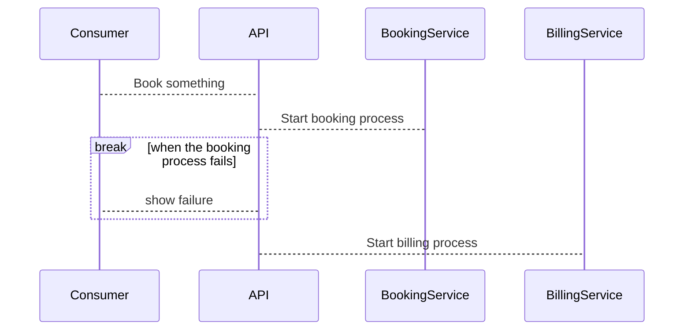
```mermaid
sequenceDiagram
    Consumer-->API: Book something
    API-->BookingService: Start booking process
    break when the booking process fails
        API-->Consumer: show failure
    end
    API-->BillingService: Start billing process

```

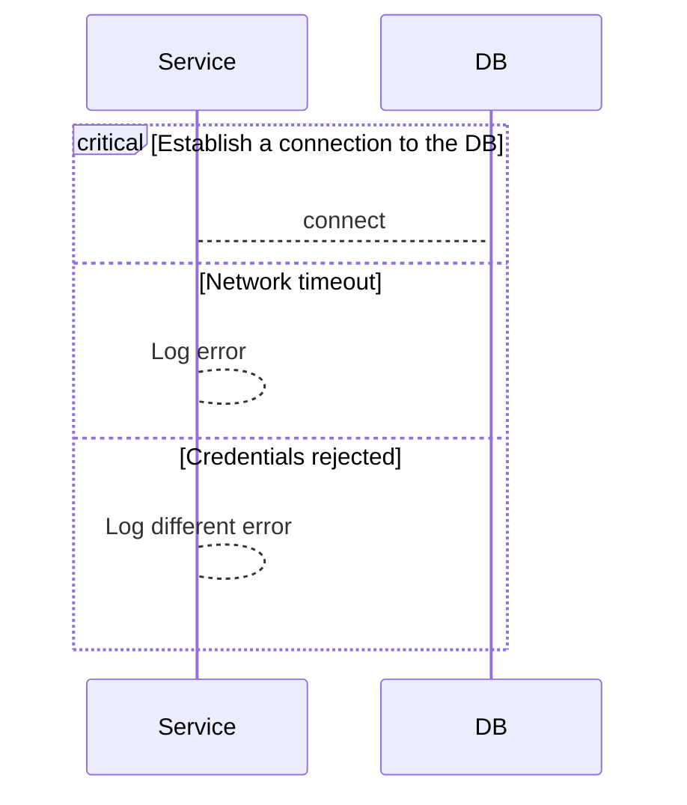
```mermaid
sequenceDiagram
    critical Establish a connection to the DB
        Service-->DB: connect
    option Network timeout
        Service-->Service: Log error
    option Credentials rejected
        Service-->Service: Log different error
    end

```

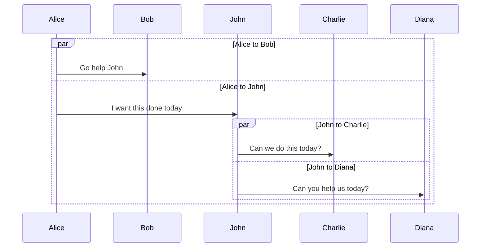
```mermaid
sequenceDiagram
    par Alice to Bob
        Alice->>Bob: Go help John
    and Alice to John
        Alice->>John: I want this done today
        par John to Charlie
            John->>Charlie: Can we do this today?
        and John to Diana
            John->>Diana: Can you help us today?
        end
    end

```

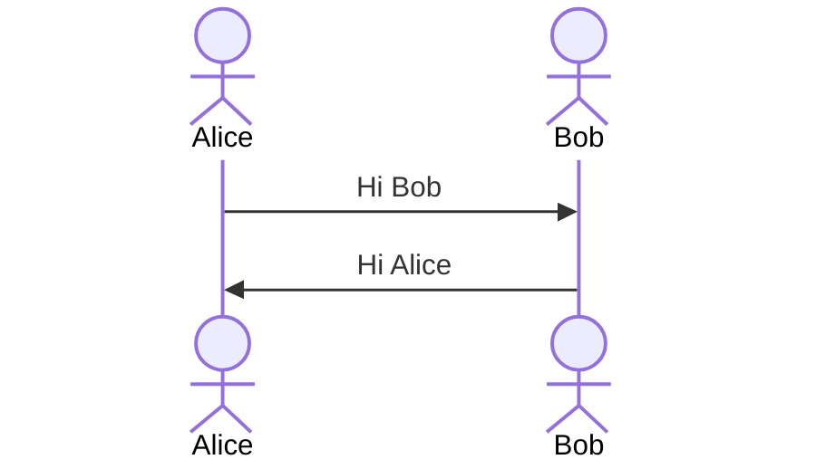
```mermaid
sequenceDiagram
    actor Alice
    actor Bob
    Alice->>Bob: Hi Bob
    Bob->>Alice: Hi Alice

```

### 流程图

https://mermaid.js.org/syntax/flowchart.html

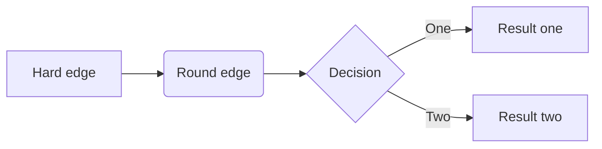
```mermaid
graph LR
A[Hard edge] -->B(Round edge)
    B --> C{Decision}
    C -->|One| D[Result one]
    C -->|Two| E[Result two]
```

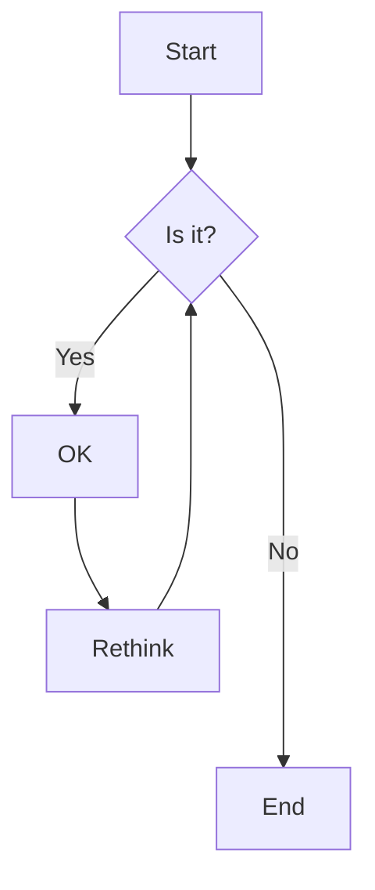
```mermaid
flowchart TD
    A[Start] --> B{Is it?}
    B -- Yes --> C[OK]
    C --> D[Rethink]
    D --> B
    B -- No ----> E[End]

```

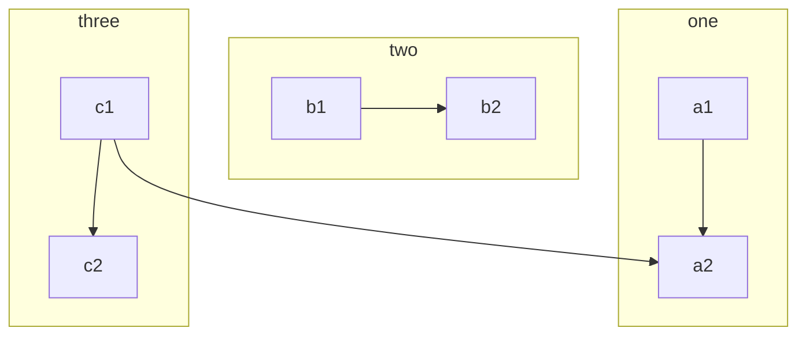
```mermaid
flowchart TB
    c1-->a2
    subgraph one
    a1-->a2
    end
    subgraph two
    b1-->b2
    end
    subgraph three
    c1-->c2
    end

```

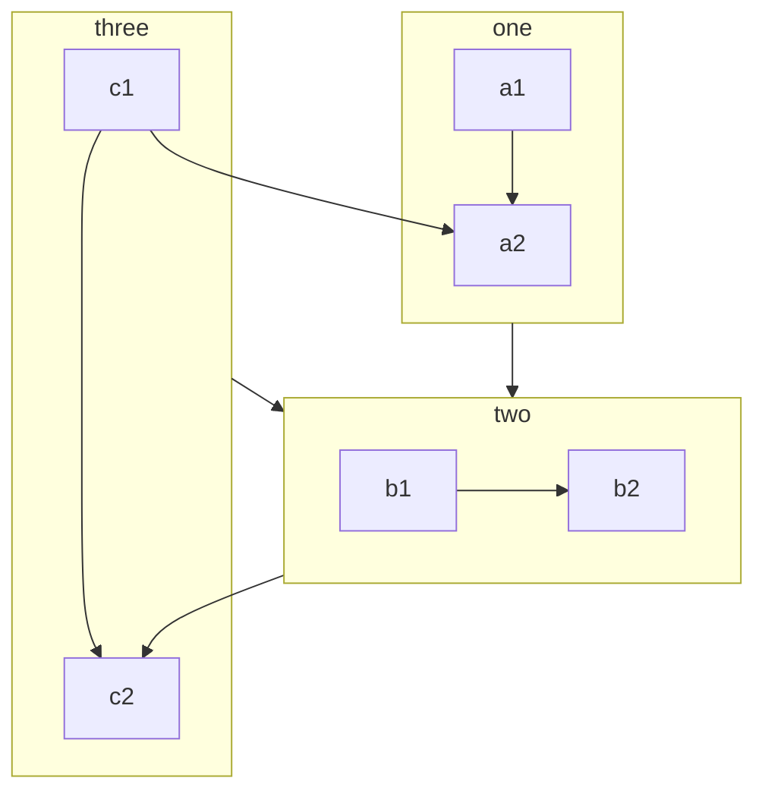
```mermaid
flowchart TB
    c1-->a2
    subgraph one
    a1-->a2
    end
    subgraph two
    b1-->b2
    end
    subgraph three
    c1-->c2
    end
    one --> two
    three --> two
    two --> c2

```

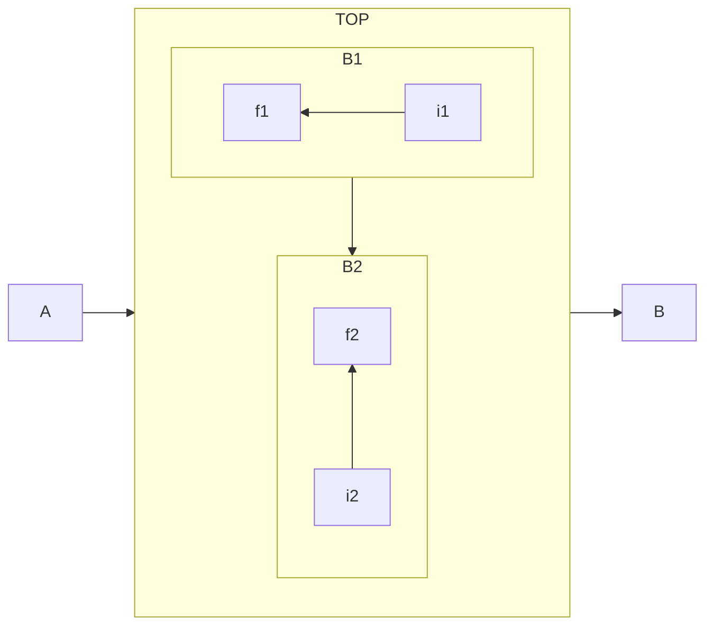
```mermaid
flowchart LR
  subgraph TOP
    direction TB
    subgraph B1
        direction RL
        i1 -->f1
    end
    subgraph B2
        direction BT
        i2 -->f2
    end
  end
  A --> TOP --> B
  B1 --> B2

```

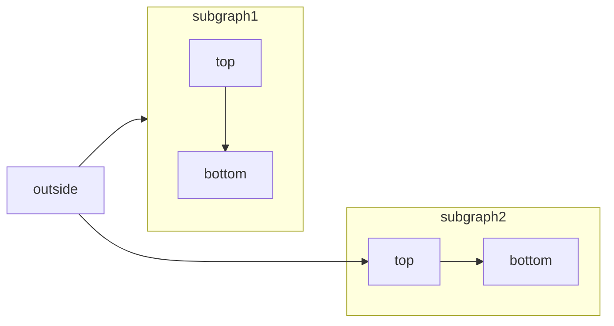
```mermaid
flowchart LR
    subgraph subgraph1
        direction TB
        top1[top] --> bottom1[bottom]
    end
    subgraph subgraph2
        direction TB
        top2[top] --> bottom2[bottom]
    end
    %% ^ These subgraphs are identical, except for the links to them:

    %% Link *to* subgraph1: subgraph1 direction is maintained
    outside --> subgraph1
    %% Link *within* subgraph2:
    %% subgraph2 inherits the direction of the top-level graph (LR)
    outside ---> top2

```

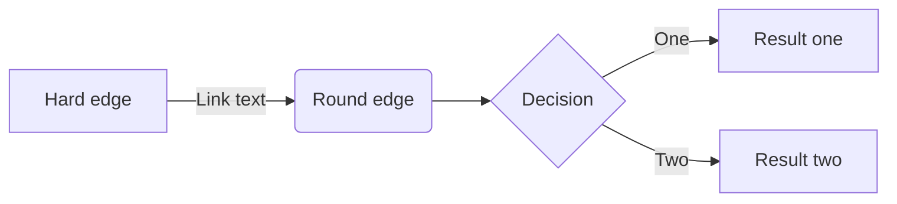
```mermaid
flowchart LR
    A[Hard edge] -->|Link text| B(Round edge)
    B --> C{Decision}
    C -->|One| D[Result one]
    C -->|Two| E[Result two]

```

### 甘特图

https://mermaid.js.org/syntax/gantt.html

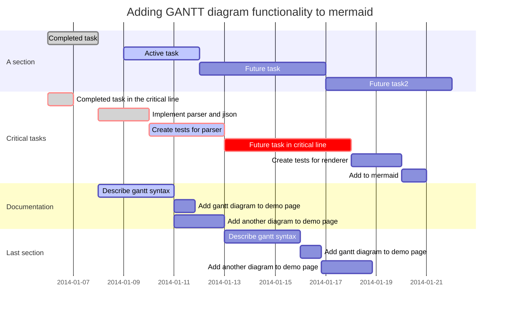
```mermaid
%% Example with selection of syntaxes
        gantt
        dateFormat  YYYY-MM-DD
        title Adding GANTT diagram functionality to mermaid

        section A section
        Completed task            :done,    des1, 2014-01-06,2014-01-08
        Active task               :active,  des2, 2014-01-09, 3d
        Future task               :         des3, after des2, 5d
        Future task2               :         des4, after des3, 5d

        section Critical tasks
        Completed task in the critical line :crit, done, 2014-01-06,24h
        Implement parser and jison          :crit, done, after des1, 2d
        Create tests for parser             :crit, active, 3d
        Future task in critical line        :crit, 5d
        Create tests for renderer           :2d
        Add to mermaid                      :1d

        section Documentation
        Describe gantt syntax               :active, a1, after des1, 3d
        Add gantt diagram to demo page      :after a1  , 20h
        Add another diagram to demo page    :doc1, after a1  , 48h

        section Last section
        Describe gantt syntax               :after doc1, 3d
        Add gantt diagram to demo page      : 20h
        Add another diagram to demo page    : 48h
```

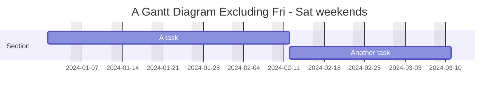
```mermaid
gantt
    title A Gantt Diagram Excluding Fri - Sat weekends
    dateFormat YYYY-MM-DD
    excludes weekends
    weekend friday
    section Section
        A task          :a1, 2024-01-01, 30d
        Another task    :after a1, 20d

```


```mermaid
gantt
    dateFormat HH:mm
    axisFormat %H:%M
    Initial milestone : milestone, m1, 17:49, 2m
    Task A : 10m
    Task B : 5m
    Final milestone : milestone, m2, 18:08, 4m

```


```mermaid
gantt
    dateFormat HH:mm
    axisFormat %H:%M
    Initial vert : vert, v1, 17:30, 2m
    Task A : 3m
    Task B : 8m
    Final vert : vert, v2, 17:58, 4m

```


```mermaid
gantt
    title Git Issues - days since last update
    dateFormat X
    axisFormat %s
    section Issue19062
    71   : 0, 71
    section Issue19401
    36   : 0, 36
    section Issue193
    34   : 0, 34
    section Issue7441
    9    : 0, 9
    section Issue1300
    5    : 0, 5

```

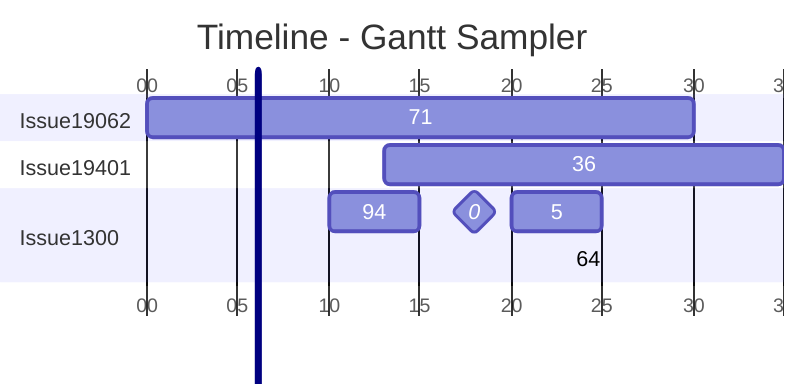
```mermaid
---
    # Frontmatter config, YAML comments
    title: Ignored if specified in chart
    displayMode: compact     #gantt specific setting but works at this level too
    config:
#        theme: forest
#        themeCSS: " #item36 { fill: CadetBlue } "
        themeCSS: " // YAML supports multiline strings using a newline markers: \n
            #item36 { fill: CadetBlue }       \n

            // Custom marker workaround CSS from forum (below)    \n
            rect[id^=workaround] { height: calc(100% - 50px) ; transform: translate(9px, 25px); y: 0; width: 1.5px; stroke: none; fill: red; }   \n
            text[id^=workaround] { fill: red; y: 100%; font-size: 15px;}
        "
        gantt:
            useWidth: 400
            rightPadding: 0
            topAxis: true  #false
            numberSectionStyles: 2
---
gantt
    title Timeline - Gantt Sampler
    dateFormat YYYY
    axisFormat %y
    %% this next line doesn't recognise 'decade' or 'year', but will silently ignore
    tickInterval 1decade

    section Issue19062
    71   :            item71, 1900, 1930
    section Issue19401
    36   :            item36, 1913, 1935
    section Issue1300
    94   :            item94, 1910, 1915
    5    :            item5,  1920, 1925
    0    : milestone, item0,  1918, 1s
    9    : vert,              1906, 1s   %% not yet official
    64   : workaround,        1923, 1s   %% custom CSS object https://github.com/mermaid-js/mermaid/issues/3250

```

### 类图

https://mermaid.js.org/syntax/classDiagram.html

```mermaid
classDiagram
      Animal <|-- Duck
      Animal <|-- Fish
      Animal <|-- Zebra
      Animal : +int age
      Animal : +String gender
      Animal: +isMammal()
      Animal: +mate()
      class Duck{
          +String beakColor
          +swim()
          +quack()
      }
      class Fish{
          -int sizeInFeet
          -canEat()
      }
      class Zebra{
          +bool is_wild
          +run()
      }
```

```mermaid
---
title: Animal example
---
classDiagram
    note "From Duck till Zebra"
    Animal <|-- Duck
    note for Duck "can fly\ncan swim\ncan dive\ncan help in debugging"
    Animal <|-- Fish
    Animal <|-- Zebra
    Animal : +int age
    Animal : +String gender
    Animal: +isMammal()
    Animal: +mate()
    class Duck{
        +String beakColor
        +swim()
        +quack()
    }
    class Fish{
        -int sizeInFeet
        -canEat()
    }
    class Zebra{
        +bool is_wild
        +run()
    }

```

```mermaid
classDiagram
class Square~Shape~{
    int id
    List~int~ position
    setPoints(List~int~ points)
    getPoints() List~int~
}

Square : -List~string~ messages
Square : +setMessages(List~string~ messages)
Square : +getMessages() List~string~
Square : +getDistanceMatrix() List~List~int~~

```

```mermaid
classDiagram
  direction RL
  class Student {
    -idCard : IdCard
  }
  class IdCard{
    -id : int
    -name : string
  }
  class Bike{
    -id : int
    -name : string
  }
  Student "1" --o "1" IdCard : carries
  Student "1" --o "1" Bike : rides

```

### 状态图

https://mermaid.js.org/syntax/stateDiagram.html

```mermaid
stateDiagram
    [*] --> Still
    Still --> [*]

    Still --> Moving
    Moving --> Still
    Moving --> Crash
    Crash --> [*]
```

```mermaid
stateDiagram-v2
    [*] --> First
    state First {
        [*] --> second
        second --> [*]
    }

    [*] --> NamedComposite
    NamedComposite: Another Composite
    state NamedComposite {
        [*] --> namedSimple
        namedSimple --> [*]
        namedSimple: Another simple
    }

```

```mermaid
stateDiagram-v2
    [*] --> First

    state First {
        [*] --> Second

        state Second {
            [*] --> second
            second --> Third

            state Third {
                [*] --> third
                third --> [*]
            }
        }
    }


```

```mermaid
stateDiagram-v2
    [*] --> First
    First --> Second
    First --> Third

    state First {
        [*] --> fir
        fir --> [*]
    }
    state Second {
        [*] --> sec
        sec --> [*]
    }
    state Third {
        [*] --> thi
        thi --> [*]
    }

```

```mermaid
stateDiagram
    direction LR
    [*] --> A
    A --> B
    B --> C
    state B {
      direction LR
      a --> b
    }
    B --> D

```

```mermaid
stateDiagram-v2
    [*] --> Active

    state Active {
        [*] --> NumLockOff
        NumLockOff --> NumLockOn : EvNumLockPressed
        NumLockOn --> NumLockOff : EvNumLockPressed
        --
        [*] --> CapsLockOff
        CapsLockOff --> CapsLockOn : EvCapsLockPressed
        CapsLockOn --> CapsLockOff : EvCapsLockPressed
        --
        [*] --> ScrollLockOff
        ScrollLockOff --> ScrollLockOn : EvScrollLockPressed
        ScrollLockOn --> ScrollLockOff : EvScrollLockPressed
    }

```

```mermaid
   stateDiagram-v2
    state fork_state <<fork>>
      [*] --> fork_state
      fork_state --> State2
      fork_state --> State3

      state join_state <<join>>
      State2 --> join_state
      State3 --> join_state
      join_state --> State4
      State4 --> [*]

```


```mermaid
stateDiagram-v2
    state if_state <<choice>>
    [*] --> IsPositive
    IsPositive --> if_state
    if_state --> False: if n < 0
    if_state --> True : if n >= 0

```

### 饼图

https://mermaid.js.org/syntax/pie.html

```mermaid
pie
    title Pie Chart
    "Dogs" : 386
    "Cats" : 85
    "Rats" : 150 
```

```mermaid
---
config:
  pie:
    textPosition: 0.5
  themeVariables:
    pieOuterStrokeWidth: "5px"
---
pie showData
    title Key elements in Product X
    "Calcium" : 42.96
    "Potassium" : 50.05
    "Magnesium" : 10.01
    "Iron" :  5

```

###  需求图requirementDiagram

https://mermaid.js.org/syntax/requirementDiagram.html

```mermaid
requirementDiagram

    requirement test_req {
    id: 1
    text: the test text.
    risk: high
    verifymethod: test
    }

    element test_entity {
    type: simulation
    }

    test_entity - satisfies -> test_req
```


```mermaid
    requirementDiagram

    requirement test_req {
    id: 1
    text: the test text.
    risk: high
    verifymethod: test
    }

    functionalRequirement test_req2 {
    id: 1.1
    text: the second test text.
    risk: low
    verifymethod: inspection
    }

    performanceRequirement test_req3 {
    id: 1.2
    text: the third test text.
    risk: medium
    verifymethod: demonstration
    }

    interfaceRequirement test_req4 {
    id: 1.2.1
    text: the fourth test text.
    risk: medium
    verifymethod: analysis
    }

    physicalRequirement test_req5 {
    id: 1.2.2
    text: the fifth test text.
    risk: medium
    verifymethod: analysis
    }

    designConstraint test_req6 {
    id: 1.2.3
    text: the sixth test text.
    risk: medium
    verifymethod: analysis
    }

    element test_entity {
    type: simulation
    }

    element test_entity2 {
    type: word doc
    docRef: reqs/test_entity
    }

    element test_entity3 {
    type: "test suite"
    docRef: github.com/all_the_tests
    }


    test_entity - satisfies -> test_req2
    test_req - traces -> test_req2
    test_req - contains -> test_req3
    test_req3 - contains -> test_req4
    test_req4 - derives -> test_req5
    test_req5 - refines -> test_req6
    test_entity3 - verifies -> test_req5
    test_req <- copies - test_entity2

```

The diagram can be rendered in different directions using the `direction` statement. Valid values are:

- `TB` - Top to Bottom (default)
- `BT` - Bottom to Top
- `LR` - Left to Right
- `RL` - Right to Left

```mermaid
requirementDiagram

direction BT

requirement test_req {
    id: 1
    text: the test text.
    risk: high
    verifymethod: test
}

element test_entity {
    type: simulation
}

test_entity - satisfies -> test_req

```

```mermaid
requirementDiagram

requirement test_req:::important {
    id: 1
    text: "class styling example"
    risk: low
    verifymethod: test
}

element test_entity {
    type: simulation
}

classDef important font-weight:bold

class test_entity important
style test_entity fill:#f9f,stroke:#333

```

### Git图

https://mermaid.js.org/syntax/gitgraph.html

```mermaid
gitGraph
       commit
       commit
       branch develop
       checkout develop
       commit
       commit
       checkout main
       merge develop
       commit
       commit
```

```mermaid
    gitGraph
       commit id: "Alpha"
       commit id: "Beta"
       commit id: "Gamma"

```


```mermaid
    gitGraph
       commit
       commit id: "Normal" tag: "v1.0.0"
       commit
       commit id: "Reverse" type: REVERSE tag: "RC_1"
       commit
       commit id: "Highlight" type: HIGHLIGHT tag: "8.8.4"
       commit

```

```mermaid
    gitGraph
       commit
       commit
       branch develop
       commit
       commit
       commit

```

```mermaid
    gitGraph
       commit
       commit
       branch develop
       commit
       commit
       commit
       checkout main
       commit
       commit

```

```mermaid
    gitGraph
       commit
       commit
       branch develop
       commit
       commit
       commit
       checkout main
       commit
       commit
       merge develop
       commit
       commit

```

```mermaid
    gitGraph
       commit id: "1"
       commit id: "2"
       branch nice_feature
       checkout nice_feature
       commit id: "3"
       checkout main
       commit id: "4"
       checkout nice_feature
       branch very_nice_feature
       checkout very_nice_feature
       commit id: "5"
       checkout main
       commit id: "6"
       checkout nice_feature
       commit id: "7"
       checkout main
       merge nice_feature id: "customID" tag: "customTag" type: REVERSE
       checkout very_nice_feature
       commit id: "8"
       checkout main
       commit id: "9"

```

```mermaid
    gitGraph
        commit id: "ZERO"
        branch develop
        branch release
        commit id:"A"
        checkout main
        commit id:"ONE"
        checkout develop
        commit id:"B"
        checkout main
        merge develop id:"MERGE"
        commit id:"TWO"
        checkout release
        cherry-pick id:"MERGE" parent:"B"
        commit id:"THREE"
        checkout develop
        commit id:"C"

```

```mermaid
---
config:
  logLevel: 'debug'
  theme: 'base'
  gitGraph:
    showBranches: false
---
      gitGraph
        commit
        branch hotfix
        checkout hotfix
        commit
        branch develop
        checkout develop
        commit id:"ash" tag:"abc"
        branch featureB
        checkout featureB
        commit type:HIGHLIGHT
        checkout main
        checkout hotfix
        commit type:NORMAL
        checkout develop
        commit type:REVERSE
        checkout featureB
        commit
        checkout main
        merge hotfix
        checkout featureB
        commit
        checkout develop
        branch featureA
        commit
        checkout develop
        merge hotfix
        checkout featureA
        commit
        checkout featureB
        commit
        checkout develop
        merge featureA
        branch release
        checkout release
        commit
        checkout main
        commit
        checkout release
        merge main
        checkout develop
        merge release

```

```mermaid
---
config:
  logLevel: 'debug'
  theme: 'base'
  gitGraph:
    rotateCommitLabel: true
---
gitGraph
  commit id: "feat(api): ..."
  commit id: "a"
  commit id: "b"
  commit id: "fix(client): .extra long label.."
  branch c2
  commit id: "feat(modules): ..."
  commit id: "test(client): ..."
  checkout main
  commit id: "fix(api): ..."
  commit id: "ci: ..."
  branch b1
  commit
  branch b2
  commit

```


```mermaid
---
config:
  logLevel: 'debug'
  theme: 'dark'
---
      gitGraph
        commit
        branch hotfix
        checkout hotfix
        commit
        branch develop
        checkout develop
        commit id:"ash" tag:"abc"
        branch featureB
        checkout featureB
        commit type:HIGHLIGHT
        checkout main
        checkout hotfix
        commit type:NORMAL
        checkout develop
        commit type:REVERSE
        checkout featureB
        commit
        checkout main
        merge hotfix
        checkout featureB
        commit
        checkout develop
        branch featureA
        commit
        checkout develop
        merge hotfix
        checkout featureA
        commit
        checkout featureB
        commit
        checkout develop
        merge featureA
        branch release
        checkout release
        commit
        checkout main
        commit
        checkout release
        merge main
        checkout develop
        merge release

```


### C4模型图

https://mermaid.js.org/syntax/c4.html

- ‌**架构图**‌（C4Context）
- ‌**容器图**‌（C4Container）
- ‌**组件图**‌（C4Component）
- ‌**动态图**‌（C4Dynamic）
- ‌**部署图**‌（C4Deployment） ‌

```mermaid
    C4Context
      title System Context diagram for Internet Banking System
      Enterprise_Boundary(b0, "BankBoundary0") {
        Person(customerA, "Banking Customer A", "A customer of the bank, with personal bank accounts.")
        Person(customerB, "Banking Customer B")
        Person_Ext(customerC, "Banking Customer C", "desc")

        Person(customerD, "Banking Customer D", "A customer of the bank, <br/> with personal bank accounts.")

        System(SystemAA, "Internet Banking System", "Allows customers to view information about their bank accounts, and make payments.")

        Enterprise_Boundary(b1, "BankBoundary") {

          SystemDb_Ext(SystemE, "Mainframe Banking System", "Stores all of the core banking information about customers, accounts, transactions, etc.")

          System_Boundary(b2, "BankBoundary2") {
            System(SystemA, "Banking System A")
            System(SystemB, "Banking System B", "A system of the bank, with personal bank accounts. next line.")
          }

          System_Ext(SystemC, "E-mail system", "The internal Microsoft Exchange e-mail system.")
          SystemDb(SystemD, "Banking System D Database", "A system of the bank, with personal bank accounts.")

          Boundary(b3, "BankBoundary3", "boundary") {
            SystemQueue(SystemF, "Banking System F Queue", "A system of the bank.")
            SystemQueue_Ext(SystemG, "Banking System G Queue", "A system of the bank, with personal bank accounts.")
          }
        }
      }

      BiRel(customerA, SystemAA, "Uses")
      BiRel(SystemAA, SystemE, "Uses")
      Rel(SystemAA, SystemC, "Sends e-mails", "SMTP")
      Rel(SystemC, customerA, "Sends e-mails to")

      UpdateElementStyle(customerA, $fontColor="red", $bgColor="grey", $borderColor="red")
      UpdateRelStyle(customerA, SystemAA, $textColor="blue", $lineColor="blue", $offsetX="5")
      UpdateRelStyle(SystemAA, SystemE, $textColor="blue", $lineColor="blue", $offsetY="-10")
      UpdateRelStyle(SystemAA, SystemC, $textColor="blue", $lineColor="blue", $offsetY="-40", $offsetX="-50")
      UpdateRelStyle(SystemC, customerA, $textColor="red", $lineColor="red", $offsetX="-50", $offsetY="20")

      UpdateLayoutConfig($c4ShapeInRow="3", $c4BoundaryInRow="1")


```

```mermaid
    C4Container
    title Container diagram for Internet Banking System

    System_Ext(email_system, "E-Mail System", "The internal Microsoft Exchange system", $tags="v1.0")
    Person(customer, Customer, "A customer of the bank, with personal bank accounts", $tags="v1.0")

    Container_Boundary(c1, "Internet Banking") {
        Container(spa, "Single-Page App", "JavaScript, Angular", "Provides all the Internet banking functionality to customers via their web browser")
        Container_Ext(mobile_app, "Mobile App", "C#, Xamarin", "Provides a limited subset of the Internet banking functionality to customers via their mobile device")
        Container(web_app, "Web Application", "Java, Spring MVC", "Delivers the static content and the Internet banking SPA")
        ContainerDb(database, "Database", "SQL Database", "Stores user registration information, hashed auth credentials, access logs, etc.")
        ContainerDb_Ext(backend_api, "API Application", "Java, Docker Container", "Provides Internet banking functionality via API")

    }

    System_Ext(banking_system, "Mainframe Banking System", "Stores all of the core banking information about customers, accounts, transactions, etc.")

    Rel(customer, web_app, "Uses", "HTTPS")
    UpdateRelStyle(customer, web_app, $offsetY="60", $offsetX="90")
    Rel(customer, spa, "Uses", "HTTPS")
    UpdateRelStyle(customer, spa, $offsetY="-40")
    Rel(customer, mobile_app, "Uses")
    UpdateRelStyle(customer, mobile_app, $offsetY="-30")

    Rel(web_app, spa, "Delivers")
    UpdateRelStyle(web_app, spa, $offsetX="130")
    Rel(spa, backend_api, "Uses", "async, JSON/HTTPS")
    Rel(mobile_app, backend_api, "Uses", "async, JSON/HTTPS")
    Rel_Back(database, backend_api, "Reads from and writes to", "sync, JDBC")

    Rel(email_system, customer, "Sends e-mails to")
    UpdateRelStyle(email_system, customer, $offsetX="-45")
    Rel(backend_api, email_system, "Sends e-mails using", "sync, SMTP")
    UpdateRelStyle(backend_api, email_system, $offsetY="-60")
    Rel(backend_api, banking_system, "Uses", "sync/async, XML/HTTPS")
    UpdateRelStyle(backend_api, banking_system, $offsetY="-50", $offsetX="-140")


```

```mermaid
    C4Component
    title Component diagram for Internet Banking System - API Application

    Container(spa, "Single Page Application", "javascript and angular", "Provides all the internet banking functionality to customers via their web browser.")
    Container(ma, "Mobile App", "Xamarin", "Provides a limited subset to the internet banking functionality to customers via their mobile device.")
    ContainerDb(db, "Database", "Relational Database Schema", "Stores user registration information, hashed authentication credentials, access logs, etc.")
    System_Ext(mbs, "Mainframe Banking System", "Stores all of the core banking information about customers, accounts, transactions, etc.")

    Container_Boundary(api, "API Application") {
        Component(sign, "Sign In Controller", "MVC Rest Controller", "Allows users to sign in to the internet banking system")
        Component(accounts, "Accounts Summary Controller", "MVC Rest Controller", "Provides customers with a summary of their bank accounts")
        Component(security, "Security Component", "Spring Bean", "Provides functionality related to singing in, changing passwords, etc.")
        Component(mbsfacade, "Mainframe Banking System Facade", "Spring Bean", "A facade onto the mainframe banking system.")

        Rel(sign, security, "Uses")
        Rel(accounts, mbsfacade, "Uses")
        Rel(security, db, "Read & write to", "JDBC")
        Rel(mbsfacade, mbs, "Uses", "XML/HTTPS")
    }

    Rel_Back(spa, sign, "Uses", "JSON/HTTPS")
    Rel(spa, accounts, "Uses", "JSON/HTTPS")

    Rel(ma, sign, "Uses", "JSON/HTTPS")
    Rel(ma, accounts, "Uses", "JSON/HTTPS")

    UpdateRelStyle(spa, sign, $offsetY="-40")
    UpdateRelStyle(spa, accounts, $offsetX="40", $offsetY="40")

    UpdateRelStyle(ma, sign, $offsetX="-90", $offsetY="40")
    UpdateRelStyle(ma, accounts, $offsetY="-40")

        UpdateRelStyle(sign, security, $offsetX="-160", $offsetY="10")
        UpdateRelStyle(accounts, mbsfacade, $offsetX="140", $offsetY="10")
        UpdateRelStyle(security, db, $offsetY="-40")
        UpdateRelStyle(mbsfacade, mbs, $offsetY="-40")


```

```mermaid
    C4Dynamic
    title Dynamic diagram for Internet Banking System - API Application

    ContainerDb(c4, "Database", "Relational Database Schema", "Stores user registration information, hashed authentication credentials, access logs, etc.")
    Container(c1, "Single-Page Application", "JavaScript and Angular", "Provides all of the Internet banking functionality to customers via their web browser.")
    Container_Boundary(b, "API Application") {
      Component(c3, "Security Component", "Spring Bean", "Provides functionality Related to signing in, changing passwords, etc.")
      Component(c2, "Sign In Controller", "Spring MVC Rest Controller", "Allows users to sign in to the Internet Banking System.")
    }
    Rel(c1, c2, "Submits credentials to", "JSON/HTTPS")
    Rel(c2, c3, "Calls isAuthenticated() on")
    Rel(c3, c4, "select * from users where username = ?", "JDBC")

    UpdateRelStyle(c1, c2, $textColor="red", $offsetY="-40")
    UpdateRelStyle(c2, c3, $textColor="red", $offsetX="-40", $offsetY="60")
    UpdateRelStyle(c3, c4, $textColor="red", $offsetY="-40", $offsetX="10")


```


```mermaid
    C4Deployment
    title Deployment Diagram for Internet Banking System - Live

    Deployment_Node(mob, "Customer's mobile device", "Apple IOS or Android"){
        Container(mobile, "Mobile App", "Xamarin", "Provides a limited subset of the Internet Banking functionality to customers via their mobile device.")
    }

    Deployment_Node(comp, "Customer's computer", "Microsoft Windows or Apple macOS"){
        Deployment_Node(browser, "Web Browser", "Google Chrome, Mozilla Firefox,<br/> Apple Safari or Microsoft Edge"){
            Container(spa, "Single Page Application", "JavaScript and Angular", "Provides all of the Internet Banking functionality to customers via their web browser.")
        }
    }

    Deployment_Node(plc, "Big Bank plc", "Big Bank plc data center"){
        Deployment_Node(dn, "bigbank-api*** x8", "Ubuntu 16.04 LTS"){
            Deployment_Node(apache, "Apache Tomcat", "Apache Tomcat 8.x"){
                Container(api, "API Application", "Java and Spring MVC", "Provides Internet Banking functionality via a JSON/HTTPS API.")
            }
        }
        Deployment_Node(bb2, "bigbank-web*** x4", "Ubuntu 16.04 LTS"){
            Deployment_Node(apache2, "Apache Tomcat", "Apache Tomcat 8.x"){
                Container(web, "Web Application", "Java and Spring MVC", "Delivers the static content and the Internet Banking single page application.")
            }
        }
        Deployment_Node(bigbankdb01, "bigbank-db01", "Ubuntu 16.04 LTS"){
            Deployment_Node(oracle, "Oracle - Primary", "Oracle 12c"){
                ContainerDb(db, "Database", "Relational Database Schema", "Stores user registration information, hashed authentication credentials, access logs, etc.")
            }
        }
        Deployment_Node(bigbankdb02, "bigbank-db02", "Ubuntu 16.04 LTS") {
            Deployment_Node(oracle2, "Oracle - Secondary", "Oracle 12c") {
                ContainerDb(db2, "Database", "Relational Database Schema", "Stores user registration information, hashed authentication credentials, access logs, etc.")
            }
        }
    }

    Rel(mobile, api, "Makes API calls to", "json/HTTPS")
    Rel(spa, api, "Makes API calls to", "json/HTTPS")
    Rel_U(web, spa, "Delivers to the customer's web browser")
    Rel(api, db, "Reads from and writes to", "JDBC")
    Rel(api, db2, "Reads from and writes to", "JDBC")
    Rel_R(db, db2, "Replicates data to")

    UpdateRelStyle(spa, api, $offsetY="-40")
    UpdateRelStyle(web, spa, $offsetY="-40")
    UpdateRelStyle(api, db, $offsetY="-20", $offsetX="5")
    UpdateRelStyle(api, db2, $offsetX="-40", $offsetY="-20")
    UpdateRelStyle(db, db2, $offsetY="-10")


```

### 思维导图

https://mermaid.js.org/syntax/mindmap.html

```mermaid
mindmap
  root((mindmap))
    Origins
      Long history
      ::icon(fa fa-book)
      Popularisation
        British popular psychology author Tony Buzan
    Research
      On effectiveness<br/>and features
      On Automatic creation
        Uses
            Creative techniques
            Strategic planning
            Argument mapping
    Tools
      Pen and paper
      Mermaid
```

```mermaid
mindmap
    id1["`**Root** with
a second line
Unicode works too: 🤓`"]
      id2["`The dog in **the** hog... a *very long text* that wraps to a new line`"]
      id3[Regular labels still works]

```

### 时间轴

https://mermaid.js.org/syntax/timeline.html

```mermaid
timeline
    title History of Social Media Platform
    2002 : LinkedIn
    2004 : Facebook
         : Google
    2005 : YouTube
    2006 : Twitter

```

```mermaid
timeline
    title Timeline of Industrial Revolution
    section 17th-20th century
        Industry 1.0 : Machinery, Water power, Steam <br>power
        Industry 2.0 : Electricity, Internal combustion engine, Mass production
        Industry 3.0 : Electronics, Computers, Automation
    section 21st century
        Industry 4.0 : Internet, Robotics, Internet of Things
        Industry 5.0 : Artificial intelligence, Big data, 3D printing


```

```mermaid
---
config:
  logLevel: 'debug'
  theme: 'default'
  themeVariables:
    cScale0: '#ff0000'
    cScaleLabel0: '#ffffff'
    cScale1: '#00ff00'
    cScale2: '#0000ff'
    cScaleLabel2: '#ffffff'
---
       timeline
        title History of Social Media Platform
          2002 : LinkedIn
          2004 : Facebook : Google
          2005 : YouTube
          2006 : Twitter
          2007 : Tumblr
          2008 : Instagram
          2010 : Pinterest


```

```mermaid
---
config:
  logLevel: 'debug'
  theme: 'neutral'
---
    timeline
        title History of Social Media Platform
          2002 : LinkedIn
          2004 : Facebook : Google
          2005 : YouTube
          2006 : Twitter
          2007 : Tumblr
          2008 : Instagram
          2010 : Pinterest

```

### 象限图

https://mermaid.js.org/syntax/quadrantChart.html

```mermaid
quadrantChart
    title Reach and engagement of campaigns
    x-axis Low Reach --> High Reach
    y-axis Low Engagement --> High Engagement
    quadrant-1 We should expand
    quadrant-2 Need to promote
    quadrant-3 Re-evaluate
    quadrant-4 May be improved
    Campaign A: [0.3, 0.6]
    Campaign B: [0.45, 0.23]
    Campaign C: [0.57, 0.69]
    Campaign D: [0.78, 0.34]
    Campaign E: [0.40, 0.34]
    Campaign F: [0.35, 0.78]

```

```mermaid
quadrantChart
  title Reach and engagement of campaigns
  x-axis Low Reach --> High Reach
  y-axis Low Engagement --> High Engagement
  quadrant-1 We should expand
  quadrant-2 Need to promote
  quadrant-3 Re-evaluate
  quadrant-4 May be improved
  Campaign A: [0.9, 0.0] radius: 12
  Campaign B:::class1: [0.8, 0.1] color: #ff3300, radius: 10
  Campaign C: [0.7, 0.2] radius: 25, color: #00ff33, stroke-color: #10f0f0
  Campaign D: [0.6, 0.3] radius: 15, stroke-color: #00ff0f, stroke-width: 5px ,color: #ff33f0
  Campaign E:::class2: [0.5, 0.4]
  Campaign F:::class3: [0.4, 0.5] color: #0000ff
  classDef class1 color: #109060
  classDef class2 color: #908342, radius : 10, stroke-color: #310085, stroke-width: 10px
  classDef class3 color: #f00fff, radius : 10

```

### 桑基图

https://mermaid.js.org/syntax/sankey.html

```mermaid
sankey-beta

%% source,target,value
Electricity grid,Over generation / exports,104.453
Electricity grid,Heating and cooling - homes,113.726
Electricity grid,H2 conversion,27.14
```

```mermaid
---
config:
  sankey:
    showValues: false
---
sankey-beta

Agricultural 'waste',Bio-conversion,124.729
Bio-conversion,Liquid,0.597
Bio-conversion,Losses,26.862
Bio-conversion,Solid,280.322
Bio-conversion,Gas,81.144
Biofuel imports,Liquid,35
Biomass imports,Solid,35
Coal imports,Coal,11.606
Coal reserves,Coal,63.965
Coal,Solid,75.571
District heating,Industry,10.639
District heating,Heating and cooling - commercial,22.505
District heating,Heating and cooling - homes,46.184
Electricity grid,Over generation / exports,104.453
Electricity grid,Heating and cooling - homes,113.726
Electricity grid,H2 conversion,27.14
Electricity grid,Industry,342.165
Electricity grid,Road transport,37.797
Electricity grid,Agriculture,4.412
Electricity grid,Heating and cooling - commercial,40.858
Electricity grid,Losses,56.691
Electricity grid,Rail transport,7.863
Electricity grid,Lighting & appliances - commercial,90.008
Electricity grid,Lighting & appliances - homes,93.494
Gas imports,Ngas,40.719
Gas reserves,Ngas,82.233
Gas,Heating and cooling - commercial,0.129
Gas,Losses,1.401
Gas,Thermal generation,151.891
Gas,Agriculture,2.096
Gas,Industry,48.58
Geothermal,Electricity grid,7.013
H2 conversion,H2,20.897
H2 conversion,Losses,6.242
H2,Road transport,20.897
Hydro,Electricity grid,6.995
Liquid,Industry,121.066
Liquid,International shipping,128.69
Liquid,Road transport,135.835
Liquid,Domestic aviation,14.458
Liquid,International aviation,206.267
Liquid,Agriculture,3.64
Liquid,National navigation,33.218
Liquid,Rail transport,4.413
Marine algae,Bio-conversion,4.375
Ngas,Gas,122.952
Nuclear,Thermal generation,839.978
Oil imports,Oil,504.287
Oil reserves,Oil,107.703
Oil,Liquid,611.99
Other waste,Solid,56.587
Other waste,Bio-conversion,77.81
Pumped heat,Heating and cooling - homes,193.026
Pumped heat,Heating and cooling - commercial,70.672
Solar PV,Electricity grid,59.901
Solar Thermal,Heating and cooling - homes,19.263
Solar,Solar Thermal,19.263
Solar,Solar PV,59.901
Solid,Agriculture,0.882
Solid,Thermal generation,400.12
Solid,Industry,46.477
Thermal generation,Electricity grid,525.531
Thermal generation,Losses,787.129
Thermal generation,District heating,79.329
Tidal,Electricity grid,9.452
UK land based bioenergy,Bio-conversion,182.01
Wave,Electricity grid,19.013
Wind,Electricity grid,289.366

```

### ZenUML时序图

https://mermaid.js.org/syntax/zenuml.html

```mermaid
zenuml
    title Demo
    Alice->John: Hello John, how are you?
    John->Alice: Great!
    Alice->John: See you later!

```

```mermaid
zenuml
    title Annotators
    @Actor Alice
    @Database Bob
    Alice->Bob: Hi Bob
    Bob->Alice: Hi Alice

```

```mermaid
zenuml
    title Reply message
    Client->A.method() {
      B.method() {
        if(condition) {
          return x1
          // return early
          @return
          A->Client: x11
        }
      }
      return x2
    }

```

```mermaid
zenuml
    try {
      Consumer->API: Book something
      API->BookingService: Start booking process
    } catch {
      API->Consumer: show failure
    } finally {
      API->BookingService: rollback status
    }

```

### XY图表

https://mermaid.js.org/syntax/xyChart.html

```mermaid
xychart-beta
    title "Sales Revenue"
    x-axis [jan, feb, mar, apr, may, jun, jul, aug, sep, oct, nov, dec]
    y-axis "Revenue (in $)" 4000 --> 11000
    bar [5000, 6000, 7500, 8200, 9500, 10500, 11000, 10200, 9200, 8500, 7000, 6000]
    line [5000, 6000, 7500, 8200, 9500, 10500, 11000, 10200, 9200, 8500, 7000, 6000]

```

```mermaid
---
config:
  themeVariables:
    xyChart:
      plotColorPalette: '#000000, #0000FF, #00FF00, #FF0000'
---
xychart-beta
title "Different Colors in xyChart"
x-axis "categoriesX" ["Category 1", "Category 2", "Category 3", "Category 4"]
y-axis "valuesY" 0 --> 50
%% Black line
line [10,20,30,40]
%% Blue bar
bar [20,30,25,35]
%% Green bar
bar [15,25,20,30]
%% Red line
line [5,15,25,35]

```

```mermaid
---
config:
    xyChart:
        width: 900
        height: 600
        showDataLabel: true
    themeVariables:
        xyChart:
            titleColor: "#ff0000"
---
xychart-beta
    title "Sales Revenue"
    x-axis [jan, feb, mar, apr, may, jun, jul, aug, sep, oct, nov, dec]
    y-axis "Revenue (in $)" 4000 --> 11000
    bar [5000, 6000, 7500, 8200, 9500, 10500, 11000, 10200, 9200, 8500, 7000, 6000]
    line [5000, 6000, 7500, 8200, 9500, 10500, 11000, 10200, 9200, 8500, 7000, 6000]

```

### 以下是其他图

#### ER图

https://mermaid.js.org/syntax/entityRelationshipDiagram.html

```mermaid
---
title: Order example
---
erDiagram
    CUSTOMER ||--o{ ORDER : places
    ORDER ||--|{ LINE-ITEM : contains
    CUSTOMER }|..|{ DELIVERY-ADDRESS : uses

```

```mermaid
erDiagram
    CUSTOMER ||--o{ ORDER : places
    CUSTOMER {
        string name
        string custNumber
        string sector
    }
    ORDER ||--|{ LINE-ITEM : contains
    ORDER {
        int orderNumber
        string deliveryAddress
    }
    LINE-ITEM {
        string productCode
        int quantity
        float pricePerUnit
    }

```

```mermaid
erDiagram
    CAR ||--o{ NAMED-DRIVER : allows
    CAR {
        string registrationNumber PK
        string make
        string model
        string[] parts
    }
    PERSON ||--o{ NAMED-DRIVER : is
    PERSON {
        string driversLicense PK "The license #"
        string(99) firstName "Only 99 characters are allowed"
        string lastName
        string phone UK
        int age
    }
    NAMED-DRIVER {
        string carRegistrationNumber PK, FK
        string driverLicence PK, FK
    }
    MANUFACTURER only one to zero or more CAR : makes

```

```mermaid
---
title: Order example
config:
    layout: elk
---
erDiagram
    CUSTOMER ||--o{ ORDER : places
    ORDER ||--|{ LINE-ITEM : contains
    CUSTOMER }|..|{ DELIVERY-ADDRESS : uses

```


```mermaid
erDiagram
    CAR {
        string registrationNumber
        string make
        string model
    }
    PERSON {
        string firstName
        string lastName
        int age
    }
    PERSON:::foo ||--|| CAR : owns
    PERSON o{--|| HOUSE:::bar : has

    classDef default fill:#f9f,stroke-width:4px
    classDef foo stroke:#f00
    classDef bar stroke:#0f0
    classDef foobar stroke:#00f

```


```mermaid
erDiagram
    direction TB
    CAR:::someclass {
        string registrationNumber
        string make
        string model
    }
    PERSON:::someclass {
        string firstName
        string lastName
        int age
    }
    HOUSE:::someclass

    classDef someclass fill:#f96

```


#### 用户旅程图 User Journey Diagram 日程图

https://mermaid.js.org/syntax/userJourney.html

```mermaid
journey
    title My working day
    section Go to work
      Make tea: 5: Me
      Go upstairs: 3: Me
      Do work: 1: Me, Cat
    section Go home
      Go downstairs: 5: Me
      Sit down: 5: Me

```


#### 块图Block Diagrams

https://mermaid.js.org/syntax/block.html

```mermaid
block-beta
columns 1
  db(("DB"))
  blockArrowId6<["&nbsp;&nbsp;&nbsp;"]>(down)
  block:ID
    A
    B["A wide one in the middle"]
    C
  end
  space
  D
  ID --> D
  C --> D
  style B fill:#969,stroke:#333,stroke-width:4px

```

```mermaid
block-beta
  columns 3
  a:3
  block:group1:2
    columns 2
    h i j k
  end
  g
  block:group2:3
    %% columns auto (default)
    l m n o p q r
  end

```


```mermaid
block-beta
  columns 3
  Start(("Start")) space:2
  down<[" "]>(down) space:2
  Decision{{"Make Decision"}} right<["Yes"]>(right) Process1["Process A"]
  downAgain<["No"]>(down) space r3<["Done"]>(down)
  Process2["Process B"] r2<["Done"]>(right) End(("End"))

  style Start fill:#969;
  style End fill:#696;

```

#### 数据包图Packet Diagram

https://mermaid.js.org/syntax/packet.html

```mermaid
---
title: "TCP Packet"
---
packet
0-15: "Source Port"
16-31: "Destination Port"
32-63: "Sequence Number"
64-95: "Acknowledgment Number"
96-99: "Data Offset"
100-105: "Reserved"
106: "URG"
107: "ACK"
108: "PSH"
109: "RST"
110: "SYN"
111: "FIN"
112-127: "Window"
128-143: "Checksum"
144-159: "Urgent Pointer"
160-191: "(Options and Padding)"
192-255: "Data (variable length)"

```


```mermaid
packet
title UDP Packet
+16: "Source Port"
+16: "Destination Port"
32-47: "Length"
48-63: "Checksum"
64-95: "Data (variable length)"

```

#### 看板图Kanban Diagram

https://mermaid.js.org/syntax/kanban.html

```mermaid
kanban
todo[Todo]
  id3[Update Database Function]@{ ticket: MC-2037, assigned: 'knsv', priority: 'High' }

```

```mermaid
---
config:
  kanban:
    ticketBaseUrl: 'https://mermaidchart.atlassian.net/browse/#TICKET#'
---
kanban
  Todo
    [Create Documentation]
    docs[Create Blog about the new diagram]
  [In progress]
    id6[Create renderer so that it works in all cases. We also add some extra text here for testing purposes. And some more just for the extra flare.]
  id9[Ready for deploy]
    id8[Design grammar]@{ assigned: 'knsv' }
  id10[Ready for test]
    id4[Create parsing tests]@{ ticket: MC-2038, assigned: 'K.Sveidqvist', priority: 'High' }
    id66[last item]@{ priority: 'Very Low', assigned: 'knsv' }
  id11[Done]
    id5[define getData]
    id2[Title of diagram is more than 100 chars when user duplicates diagram with 100 char]@{ ticket: MC-2036, priority: 'Very High'}
    id3[Update DB function]@{ ticket: MC-2037, assigned: knsv, priority: 'High' }

  id12[Can't reproduce]
    id3[Weird flickering in Firefox]

```


#### 架构图Architecture Diagrams

https://mermaid.js.org/syntax/architecture.html

```mermaid
architecture-beta
    group api(cloud)[API]

    service db(database)[Database] in api
    service disk1(disk)[Storage] in api
    service disk2(disk)[Storage] in api
    service server(server)[Server] in api

    db:L -- R:server
    disk1:T -- B:server
    disk2:T -- B:db

```

```mermaid
architecture-beta
    service left_disk(disk)[Disk]
    service top_disk(disk)[Disk]
    service bottom_disk(disk)[Disk]
    service top_gateway(internet)[Gateway]
    service bottom_gateway(internet)[Gateway]
    junction junctionCenter
    junction junctionRight

    left_disk:R -- L:junctionCenter
    top_disk:B -- T:junctionCenter
    bottom_disk:T -- B:junctionCenter
    junctionCenter:R -- L:junctionRight
    top_gateway:B -- T:junctionRight
    bottom_gateway:T -- B:junctionRight

```


#### 雷达图Radar Diagram

https://mermaid.js.org/syntax/radar.html

```mermaid
---
title: "Grades"
---
radar-beta
  axis m["Math"], s["Science"], e["English"]
  axis h["History"], g["Geography"], a["Art"]
  curve a["Alice"]{85, 90, 80, 70, 75, 90}
  curve b["Bob"]{70, 75, 85, 80, 90, 85}

  max 100
  min 0

```

```mermaid
---
config:
  radar:
    axisScaleFactor: 0.25
    curveTension: 0.1
  theme: base
  themeVariables:
    cScale0: "#FF0000"
    cScale1: "#00FF00"
    cScale2: "#0000FF"
    radar:
      curveOpacity: 0
---
radar-beta
  axis A, B, C, D, E
  curve c1{1,2,3,4,5}
  curve c2{5,4,3,2,1}
  curve c3{3,3,3,3,3}

```


#### 矩形树图Treemap Diagram

https://mermaid.js.org/syntax/treemap.html

```mermaid
treemap-beta
"Category A"
    "Item A1": 10
    "Item A2": 20
"Category B"
    "Item B1": 15
    "Item B2": 25

```

```mermaid
treemap-beta
"Products"
    "Electronics"
        "Phones": 50
        "Computers": 30
        "Accessories": 20
    "Clothing"
        "Men's": 40
        "Women's": 40

```

```mermaid
treemap-beta
"Section 1"
    "Leaf 1.1": 12
    "Section 1.2":::class1
      "Leaf 1.2.1": 12
"Section 2"
    "Leaf 2.1": 20:::class1
    "Leaf 2.2": 25
    "Leaf 2.3": 12

classDef class1 fill:red,color:blue,stroke:#FFD600;

```

```mermaid
---
config:
  treemap:
    valueFormat: '$.1%'
---
treemap-beta
"Market Share"
    "Company A": 0.35
    "Company B": 0.25
    "Company C": 0.15
    "Others": 0.25

```

### **Mermaid**配置项

您可以通过添加[自定义CSS](https://support.typora.io/Add-Custom-CSS/)来更支持的选项包括：

```css
:root {
  --mermaid-theme: default; /*or base, dark, forest, neutral, night */
  --mermaid-font-family: "trebuchet ms", verdana, arial, sans-serif;
  --mermaid-sequence-numbers: off; /* or "on", see https://mermaid-js.github.io/mermaid/#/sequenceDiagram?id=sequencenumbers*/
  --mermaid-flowchart-curve: linear /* or "basis", see https://github.com/typora/typora-issues/issues/1632*/;
  --mermaid--gantt-left-padding: 75; /* see https://github.com/typora/typora-issues/issues/1665*/
}
```

#### 图表对齐

您可以通过按照[“添加自定义CSS](https://support.typora.io/Add-Custom-CSS/)”向左对齐图表来添加下面的自定义CSS。

```css
.md-diagram-panel-preview {text-align:left;}
```


#### 主题

The `--mermaid-theme` css variable can quickly define a mermaid theme that fits your theme, the value can be `base`, `default`, `dark`, `forest`, `neutral` or `night` (the one used in night theme), for example:

```css
:root {--mermaid-theme:dark;}
:root {--mermaid-theme:neutral;}
:root {--mermaid-theme:forest;}
```

#### 自动编号

在[自定义CSS](https://support.typora.io/Add-Custom-CSS/)中添加`--mermaid-sequence-numbers: on`

#### 流程图曲线

| –mermaid-flowchart-curve: linear;                            | –mermaid-flowchart-curve: basis                              | –mermaid-flowchart-curve: natural;                           | –mermaid-flowchart-curve: step;                              |
| ------------------------------------------------------------ | ------------------------------------------------------------ | ------------------------------------------------------------ | ------------------------------------------------------------ |
|  |  |  |  |

#### 甘特填充物

| –mermaid–gantt-left-padding:75                               | –mermaid–gantt-left-padding:200                              |
| ------------------------------------------------------------ | ------------------------------------------------------------ |
|  |  |

#### 内联配置

 `%%{init: [options]}%%` 添加到第一行以配置


